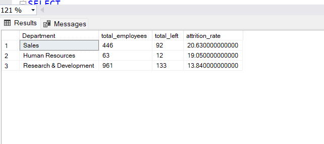
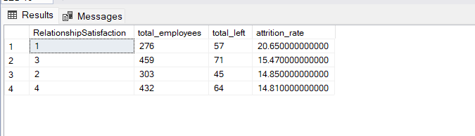
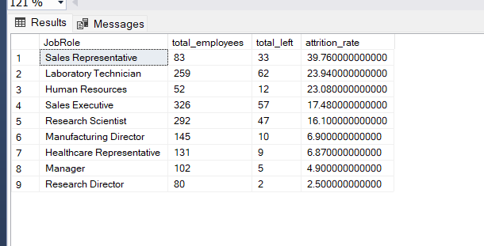

# HR-Attrition-Analysis--SQL
SQL-based HR analytics project to identify key factors driving employee attrition using IBM HR dataset.
# HR Attrition Analysis Using SQL

## 🎯 Project Objective
This project analyzes IBM HR Analytics employee data using SQL to identify key factors influencing employee attrition.

The goal is to understand why employees leave the company and discover patterns related to:
- Salary
- Overtime
- Department
- Job roles
- Relationship satisfaction
- Workplace behavior

---

## 🛠️ Tools Used
- MS SQL Server
- SQL Server Management Studio (SSMS)
- Excel
- GitHub

---

## 📂 Dataset
IBM HR Analytics Employee Attrition Dataset

---

## 🔍 Key Business Questions
1. What is the overall attrition rate?
2. Which department has the highest attrition?
3. Does salary impact attrition?
4. Does overtime affect attrition?
5. Which job roles experience the highest attrition?
6. Does relationship satisfaction influence attrition?

---

## 📈 Key Insights

### 1. Overall Attrition Rate
- Attrition rate is approximately **16.1%**

### 2. Department-wise Attrition
- Sales department has the highest attrition rate (~20.6%)

### 3. Salary Impact
- Low salary employees show the highest attrition (~28.6%)

### 4. Overtime Impact
- Employees working overtime are nearly 3x more likely to leave

### 5. Relationship Satisfaction
- Employees with lower relationship satisfaction show higher attrition

### 6. Job Role Analysis
- Sales Representatives show the highest attrition (~39.8%)

---

## 🧠 Skills Demonstrated
- SQL Aggregations
- CASE Statements
- GROUP BY
- Conditional Analysis
- Business Insights
- HR Analytics
- Data Cleaning

---

## 📌 Final Conclusion
The analysis suggests that employee attrition is strongly associated with:
- Low salary
- Overtime/workload
- Sales-related roles
- Lower workplace relationship satisfaction

Employees in Sales roles with low salary and overtime represent the highest-risk employee segment.

Improving compensation, reducing excessive workload, and strengthening workplace environment may help improve employee retention.

---

---

## 📸 Sample Analysis Results

### Attrition Rate

### Department-wise Attrition Rate

### Salary Impact Analysis

### Department + Salary Analysis

### Overtime Impact

### Relationship Satisfaction Analysis

### Job Role Analysis

